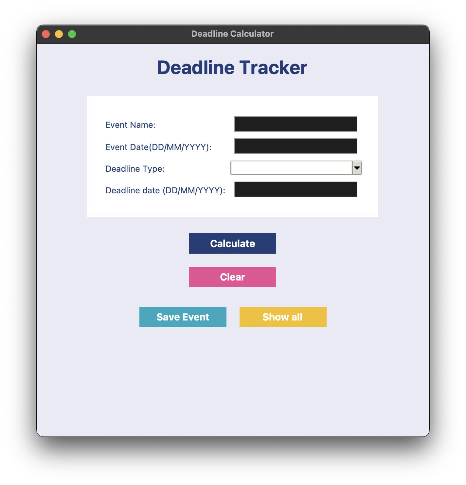
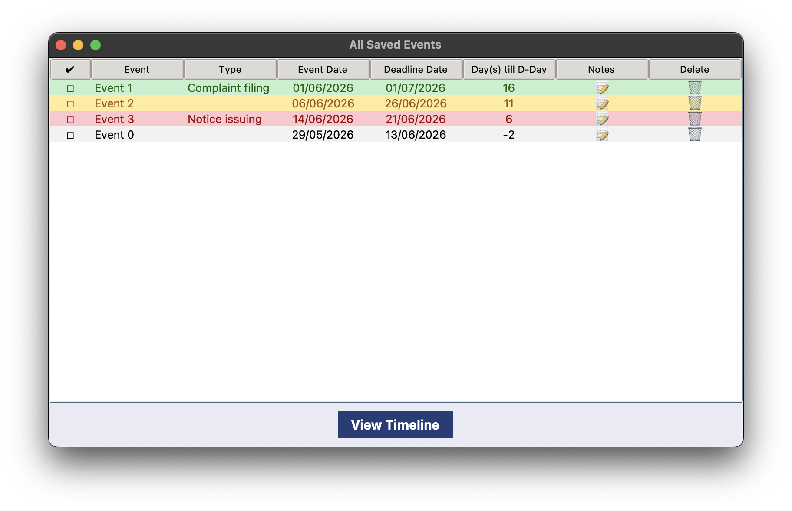
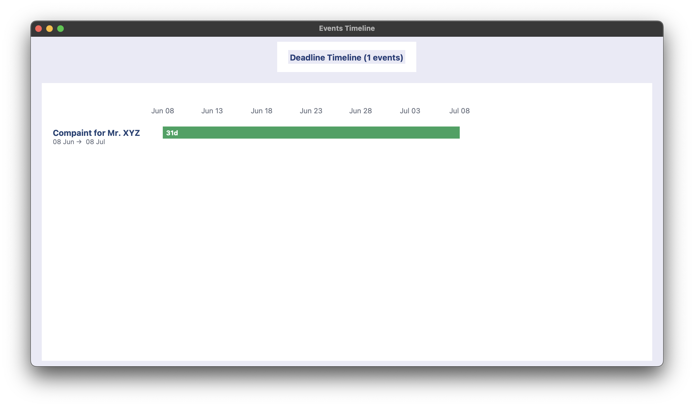

# TrackIt

Deadline tracker for lawyers in python using tkinter library

## Features:
- track deadlines
- use ui library ttkbootstrap
- multiple views (table view, timeline view)
- highlights for today's date 
- traffic light system for overall better ux

## DEMO VIDEO

https://github.com/user-attachments/assets/37e38965-64cc-4668-89af-58d820e1220f

## Screenshots

main app view

all events - table view

timeline view

## Why I Made This
When i was looking for app inspiration for particular use case (brainstorming loosely with ai), I came acroos this idea for building a deadline tracker for a profession. I considered doctor, etc. but ended up choosing lawyer since I didn't know much about the other professions and my sister is a lawyer so i could ask for some basic things.

## Learnings
- better learnt python since I only knew some basics before
- learnt tkinter and making apps with it [this is my first app with GUI using tkinter/python]
- did a lot of debugging
- learnt how to create executable file for apps

## Run Locally
1. Install `Python`
2. `tkinter` module comes built-in in normal python installation for all OS. no need to install any modules separately.
3. Clone this github repo
4. Run `main.py`
   - Python IDLE: open `main.py` and run the file
   - From the terminal: run the file from root directory using command `python main.py`

## Credits
- made by: [me](https://github.com/strawberryskeleton)
- idea refinement help: my sister
- libraries used: tkinter (pre-installed with python installation)
- some debugging help (for color correcting on mac) from Gemini AI
